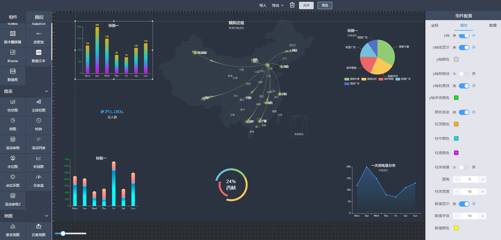

# Vue 3 + Vite

参考开源代码修改： 基于VUE3， AntDesign3x，echarts，dataV，实现拖拽 + 配置方式生成数据大屏.

## Recommended IDE Setup

## 概览
如需要自行添加功能
功能：
- 拖拽生成图表
- 拖拽生成数据大屏
- 预览
- 参考线
- 刻度
- 缩放
- 画布设置
截图：

- [VS Code](https://code.visualstudio.com/) + [Volar](https://marketplace.visualstudio.com/items?itemName=Vue.volar) (and disable Vetur) + [TypeScript Vue Plugin (Volar)](https://marketplace.visualstudio.com/items?itemName=Vue.vscode-typescript-vue-plugin).
